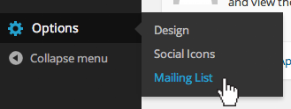

Boombox is a simple, one-page Wordpress theme designed and crafted specifically for musicians.

This guide is intended to be all-inclusive and detailed.
If you are familiar with Wordpress it may get a bit dull but should still have the information you need.

This guide also assumes that you already have a web host set up and Wordpress installed.
If you do not, we **STRONGLY** recommend [Flywheel](http://getflywheel.com) for premium Wordpress hosting, and [Hover](https://hover.com/cJMyeTkL) for domain name purchasing.

If you cannot find what you are looking for in the guide don't hesitate to email us for help at <support@branberg.com>

Initial Setup
=============
Logging In
----------
Logging in is simple, just go to "_yourwebsite.com_/**wp-admin**" and fill in your username & password

Installation
------------

Congrats! You're signed into Wordpress and you've downloaded the boombox.zip theme package.
The next steps are to add the theme to Wordpress by uploading the zip file and activating it.  

_Don't have the ZIP file? Check the download link you received when purchasing the theme or [contact us for help](mailto:support@branberg.com) and we'll re-send it to you!_

### Upload ZIP
1. From your Dashboard, navigate to "Appearance" -> "Themes"
2. Click  at the top of the screen
2. Click the  button at the top of the screen
3. Find your .zip file (by file browser or clicking-and-dragging)
4. Click 

### Activate
Once the theme is uploaded you will be provided with some options, choose the "Activate" option.

### Troubleshoot
Sometimes (depending on your host), you may encounter some issues uploading the theme.
Overall, make sure the file permissions on your uploads directory are accurate and that your host's upload limits are large enough.  
This can get tricky, if you run into a problem you can't solve yourself contact us or your web host.

Sections
========
Boombox is special because it uses page sections for custom and dynamic layouts.
Each page section can be added, removed, rearranged and customized.

This theme has four different section types:

1. Soundcloud Embed
2. Video Embed (Youtube/Vimeo)
3. Custom Text
4. Photo Gallery

Adding Sections
---------------
1. Go to "Pages" -> "home"
2. Click Edit
3. Click "Add Section" and choose which feature from the menu that you'd like to add.  

   
4. Fill in the section's information accurately (specific section documentation included below)
5. Click 

Music Embeds
------------
Boombox uses [Soundcloud](http://soundcloud.com) for its music embeds.
This means you need a Soundcloud account in order to add music to your Boombox-powered website.

If you do not have a Soundcloud account you can create one for free [here](https://soundcloud.com/signup).

Adding a Soundcloud embed is easy:

1. Add "Soundcloud Feature"
2. Enter the specific Soundcloud iframe code in the provided field (To obtain this, go to your Soundcloud song or set and click "Share" then the "Embed" tab. Then you will see a preview and some iframe code. Copy and paste that code here)
3. Enter "Feature Type" (Single, Album, Ep, Mixtape, Other)
4. Enter "Feature Title"
5. Enter "Feature Description"
6. Enter "Button Text" (EX: Purchase, Download, Listen, etc)
7. Enter "Button URL"
8. Click "Update"

Video Embeds
------------
Boombox supports both Vimeo and YouTube embeds.

To embed a Vimeo or YouTube video:

1. Add "Video Embed" Section
2. Enter the specific video iframe code in the provided field
    - To obtain this on Vimeo, go to your Vimeo video and click "share" then copy the text from the "Embed" section and paste it into the provided field.
    - To obtain this on YouTube, go to your video and click "Share" then "Embed" copy the text and paste it into the provided field).
3. Click "Update"

Custom Text
-----------
Adding a small blurb of text to your Boombox site is Simple:

1. Add "Custom Text"
2. Fill out the "Text Field" on the right (text editor displays entered text as it will appear on the website).
3. Click "Update"

Photo Galleries
---------------
The Photo Gallery Section takes advantage of the built-in Wordpress media library.

To add photos:

1. Add Photo Gallery Section
2. Click on the  button
3. Drag-and-drop (or use upload window) photos from your computer into the media library window (You can add multiple photos at once)
4. Photos will be automatically uploaded and converted to the right size to display on the site
5. Click-and-drag to move photos to desired arrangement.
6. Click "Update"

**Try to keep photos within a 1920x1080 px frame otherwise they will take quite a while to load when viewing**

Re-ordering Sections
--------------------
To re-order Sections:

1. Hover the title (Ex: "Photo Gallery") of the section you'd like to re-order (notice a directional cursor appears)
2. Drag selected section up/down to desired location above/below another section and drop it
3. Click "Update"

Removing Sections
-----------------
To remove a section entirely:

1. Hover the title (Ex: "Video Embed") of the section you'd like to remove (notice a  symbol on the far right)
2. Click the  symbol
3. Click "Update"

Logo
====
One of the many customization options on your Boombox site is the ability to upload your own logo and favicon. As a Boombox Standard, if no image/logo is present, the site name will be shown. This can be changed in "Settings > General > Site Title". 

Logo
-------------
To add your own logo:

1. From your Dashboard, navigate to "Options" -> "Design"
2. Click the "Logo" tab towards the top of the screen (it should already be open).
3. Scroll to the "Logo" Section of the page and click 
4. Drag-and-drop (or use upload window) the image from your computer into the media library window
5. Click 

**Boombox has been built to utilize a wide range of sizes for the logo, but you should still try and keep it smaller than about 900x300px, otherwise some unexpected results may occur.**

To remove a logo:

1. From your Dashboard, navigate to "Options" -> "Design"
2. Click the "Logo" tab towards the top of the screen (it should already be open)
3. Hover the logo/image you'd like to remove
4. Click the "X" icon
5. Click "Save Options"

Favicon
----------------
To add your own favicon:

1. From your Dashboard, navigate to "Options" -> "Design"
2. Click the "Logo" tab towards the top of the screen (it should already be open)
3. Go to the "Favicon" Section of the page and click 
4. Drag-and-drop (or use upload window) the favicon from your computer into the media library window
5. Click "Save Options"

**This should be a 16x16px .png image**

To remove a favicon:

1. From your Dashboard, navigate to "Options"-> "Design"
2. Click the "Logo" tab towards the top of the screen (it should already be open)
3. Hover the favicon/image you'd like to remove
4. Click the "X" icon
5. Click "Save Options"

Background
==========
Boombox offers a high level of customization for your background. Choose your colors, add your own image or pattern, and more.

Image & Color Overlay
---------------------

1. From your Dashboard, navigate to "Options" -> "Design"
2. Click the "Background" tab towards the top of the window.
3. Go to the "Background Image" Section of the page and click 
3. Drag-and-drop (or use upload window) the image from your computer into the media library window
4. Select the "Background Position" (Fullscreen, Top Left, Top Middle, Centered)
5. Select "Background Repeat" (Repeat, Repeat Horizontally, Repeat Vertically, No Repeat)
6. Select "Background Attachment" (Scrolling Background, Fixed Background)
7. Select "Background Overlay Color"
8. Determine "Background Overlay Opacity" (100 is fully opaque, 0 is fully transparent. To turn off the background overlay, simply set this value to 0)
9. Click "Save Options"

Pattern
-------
Boombox allows for the use of patterns and textures in the background.  
We recommend [Subtle Patterns](http://subtlepatterns.com/) for an array of truly awesome (and free!) pattern options.  
Example Subtle Pattern:  

1. From your Dashboard, navigate to "Options" -> "Design"
2. Click the "Background" tab towards the top of the window
3. Go to the "Background Image" Section of the page and click 
3. Drag-and-drop (or use upload window) the pattern tile from your computer into the media library window
4. Under "Background Position" select "Top Left"
5. Under "Background Repeat" select either "Repeat, Repeat Horizontally, or Repeat Vertically"
6. Under "Background Attachment" select "Fixed Background"
7. Leave "Background Overlay Color" blank
8. Set "Background Overlay Opacity" to "0"
9. Click "Save Options"

Solid Color
-----------
If you're looking to apply a solid color as your site background:

1. Delete "Background Image" if you have one.
2. Select or enter desired "Background Overlay Color"
3. Set "Background Overlay Opacity" to "100"
4. Click "Save Options"

Fonts
==========
Boombox offers a wide selection of Google Fonts to customize your site.

To change your fonts:

1. From your Dashboard, navigate to "Options" -> "Design"
2. Click the "Fonts" tab towards the top of the window.

Heading Font Type
-----------------
Your Heading Font Type is the font that will be used as your Site Title, Mobile Menu Text, Album Type Text, Album Button Text, Menu Links, Mailing List Text, and your Credits.

3. Under "Heading Font Type" select "Google Font" and pick a font (See "Custom Fonts" section below for custom fonts)
4. Click "Save Options"

Body Font Type
--------------
Anything excluded from "Heading Font Type" (Description Text and Custom Text)

3. Under "Body Font Type" Select "Google Font" and pick a font (See "Custom Fonts" section below for custom fonts)
4. Click "Save Options"

Custom Fonts
------------
Before web fonts were widely used, websites needed a font stack of commonly available fonts to choose from.  
If you choose not to use an included web font, then you must specify a custom font stack.  

Click this [link](http://cssfontstack.com/) for examples of popular font stacks you can use.  

If you would like to suggest a new Google font to be added to the list, please ask us by clicking this [link](mailto:support@branberg.com?subject=New%20Web%20Font%20Request) and we’ll get it added asap.

Colors
===========

Site Colors
-----------
To alter your overall site colors:

1. From your Dashboard, navigate to "Options" -> "Design"
2. Click the "Site Colors" tab towards the top of the window
3. "Main Color" (Text, Forms, Mobile Menu Background, Link Colors)
4. "Menu Color" (Social Links, and Menu)
5. "Footer Text Color"
6. Click "Save Options"

Music Colors
------------
To alter your music colors:

1. From your Dashboard, navigate to "Options" -> "Design"
2. Click the "Music Colors" tab towards the top of the window
3. "Music Background Color" (he background color as well as the color of the text inside the button)
4. "Music Text Color" (color of the text and the button)
5. Click "Save Options"

Mobile Colors
-------------
To alter your site's mobile colors (the colors of the elements that only appear on small/mobile screens):

1. From your Dashboard, navigate to "Options" -> "Design"
2. Click the "Mobile" tab towards the top of the window
3. "Mobile Menu Background Color"
4. "Mobile Menu Text Color"
5. Click "Save Options"

Social Icons
============
Boombox offers over 15 social icons for your site. Everything from Google+ to Spotify. Have any recommendations or suggestions of icons to add? Contact us by emailing us [here](mailto:support@branberg.com?subject=New%20Web%20Font%20Request).

Adding Icons
------------
To add new icons to your site:

1. From your Dashboard, navigate to "Options" -> "Social Icons"
2. Click  
3. Select specific "Social Network" from the dropdown menu
4. Enter its respective URL into the space on the right
5. Click "Save Options"

Removing Icons
--------------
To remove icons:

1. From your Dashboard, navigate to "Options" -> "Social Icons"
2. Hover the icon you'd like to remove
3. click   on the far right
4. Click "Save Options"

Re-ordering Icons
-----------------
To re-order your icons:

1. From your Dashboard, navigate to "Options" -> "Social Icons"
2. Hover the number (far left) of the icon you'd like to reorder (notice the directional arrows)
3. Drag/Drop the icon to desired location
4. Click "Save Options"

Mailing Lists
=============
Boombox currently officially supports two mailing list implementations.
[Mailchimp](http://mailchimp.com) and [Fanbridge](http://fanbridge.com).  
The mailing lists appear in the footer of your site, right above the credits/copyright.

Setup
-----
To utilize the Mailing list, follow the following steps:

1. Head over to the "Options" > "Mailing List" section of your site.  

     
2. By default, the mailing list is turned off, but to turn it on simply toggle the option you are looking to enable it.  
   
     
3. Fill out the appropriate settings for the Mailing List you selected. See below for details on each Mailing List option.

###Mailchimp
 To use Mailchimp, you first must have a Mailchimp account set up. If you do not, head to their [sign up page](https://login.mailchimp.com/signup) to create a free account.  
_With a free account you can send emails to up to 2000 subscribers per month_

Once you are signed in, follow these steps:

1. Create a List (**if you already have a list created, skip to step 4**)  
   _Mailchimp works by collecting lists of email addresses, and sending email campaigns to those lists of people._  
   
   To create a list, click the "Lists" link in Mailchimp's sidebar.  
   
   
   
   Then click the  button in the upper right corner of your screen.
2. It will (probably) ask you about groups and list management. Groups are handy when juggling a lot of subscribers, but for now let's just create a list.
3. Give the list a **name**, **"From" Email**, **"From" Name**, and a short **Reminder** how they got subscribed to this list.  
   Something like "You are subscribed to this list because you signed up on myawesomewebsite.com" should do the trick.  
   Then simply make sure your contact info is correct and, select the notification options you'd like and click "Save"!
4. When viewing your list, click the tab at the top titled "Signup Forms"
5. Click "Embedded Forms"
6. Right under where it says "Embedded Form Code", select the option that says "Super Slim" **Your form will not look correct if you use anything other than this method**
7. Change title to something shorter such as "Mailing List"
8. Ignore the "Set Width" field, this is automatically set by the theme.
9. Copy the generated form code from Mailchimp and paste it into the text box on your site that appears when you selected the Mailchimp option
10. Click "Save Options" and you're done!

###Fanbridge
Fan Bridge is a bit of a different process than Mailchimp as it requires a separate Wordpress Plugin to install.  
**[Install the Wordpress "Fanbridge Signup" plugin here](https://wordpress.org/plugins/fanbridge-signup/)**  

Once the plugin is installed and your Fanbridge account is set up, follow these steps:  

1. Configure the plugin. This is done by going to The Fanbridge Settings page in Wordpress. "Settings" > "Fanbridge Signup"  
   
   
2. Fill in the information on this page. Take note, the User ID (field 1) is needed to connect to your Fanbridge account.
3. Click "Save Settings"
4. Go back to your optional panel ("Options" > "Mailing List") and verify that the Fanbridge option is selected.
5. Click "Save Options" and you're done!

Logging Out
===========
Logging out is easy

1. From your Dashboard or the top bar hover your username in the upper right corner
2. Click "Log Out" from the options

You now have your very own Wordpress site, thank you for choosing Boombox!

